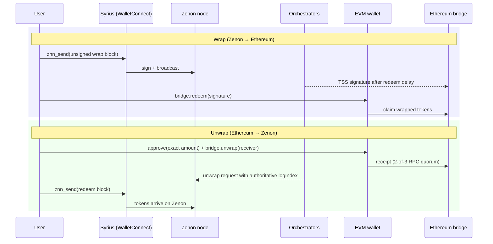

# NoM Bridge

A web dApp for moving tokens between **Zenon Network of Momentum (NoM)** and
**Ethereum** through the Zenon community bridge. Wrap ZNN, QSR, WBTC, and the
ZNN/ETH LP token from Zenon to Ethereum, or unwrap them back.

- **Live app:** <https://nom-bridge.0x3639.com>
- **Bridge operator status:** <https://status.bridge.zenon.community/>
- **Security model:** [`docs/security-model.md`](docs/security-model.md)

The app is a thin, safety-first front end. It does not custody funds, run its
own signer, or add features beyond bridging: liquidity, staking, referrals, and
affiliate routing are deliberately out of scope.

## How it works

The bridge is operated by Zenon's orchestrator set, which watches both chains
and signs transfers with a threshold signature (TSS). Every transfer is two
independent legs, and the app tracks in-flight requests locally so either leg
can be resumed later from the **Requests** page.



- **Wrap:** the app builds an *unsigned* account block for the NoM embedded
  bridge contract; Syrius fills in plasma/PoW, signs, and broadcasts it. After
  the orchestrators sign and the on-chain redeem delay elapses, the user submits
  `redeem` on Ethereum with the TSS signature.
- **Unwrap:** an exact-amount ERC-20 `approve` followed by `bridge.unwrap`,
  both simulated before sending and both requiring a mined receipt. Later the
  user redeems on Zenon via Syrius, using the node's authoritative log index.
- **Self-referral bonus:** when the bridge advertises its affiliate program as
  active for a pair, the unwrap receiver is `zenonAddr&zenonAddr`, so the
  destination address itself collects the 1% + 2% bonus (the 2% arrives as a
  separate request). See [`docs/security-model.md`](docs/security-model.md#unwrap-self-referral-bonus).

Wallets: **Syrius** for Zenon (WalletConnect v2, `zenon` namespace) and any
injected EIP-1193 wallet such as MetaMask for Ethereum.

## Supported pairs (mainnet, pinned)

| Zenon token | Ethereum token | Address | Decimals |
| --- | --- | --- | ---: |
| ZNN | wZNN | `0xb2e96a63479c2edd2fd62b382c89d5ca79f572d3` | 8 |
| QSR | wQSR | `0x96546afe4a21515a3a30cd3fd64a70eb478dc174` | 8 |
| ZNNETHLP | UNI-V2 | `0xdac866a3796f85cb84a914d98faec052e3b5596d` | 18 |
| WBTC | WBTC | `0x2260fac5e5542a773aa44fbcfedf7c193bc2c599` | 8 |

Ethereum bridge contract: `0xa98706106f7710d743186031be2245f33acea106`.

These are hard-coded in [`src/config.ts`](src/config.ts). If the Zenon node
advertises a different bridge or token address, the app **fails closed**; pairs
it does not recognise are not shown. Changing a pair is a reviewed release, not
a runtime setting. Testnet mode intentionally throws until a verified testnet
allowlist exists.

## Safety model (summary)

The full statement is [`docs/security-model.md`](docs/security-model.md).
Invariants enforced in code:

1. Pinned bridge and token addresses; mismatch fails closed.
2. Bridge state is re-fetched before every transfer and the transfer is
   blocked on halt, key-gen, disabled direction, wrong chain, minimum not
   met, or insufficient balance.
3. Ethereum writes are simulated first, use **exact** allowances (never
   infinite approve), and require a successful receipt.
4. An unwrap is only treated as confirmed when at least two of the three
   configured EVM RPCs report success for the same transaction hash.
5. Ambiguous wrap submissions leave a durable duplicate-submit lock that is
   released only when both pinned Zenon RPCs agree on the confirmed block.
6. Zenon redeems use the node's authoritative `logIndex`; the browser-decoded
   value is display-only.
7. Amounts are `bigint` end-to-end; no floating point touches token values.

The bridge contracts themselves were reviewed by ChainSafe in 2023; that audit
did not cover this front end, the orchestrators, or WalletConnect. Bridge
availability and finality depend on the orchestrator set.

## Getting started

Requirements: Node 22 or 24, npm, and a WalletConnect Cloud project id.

```sh
git clone https://github.com/0x3639/nom-bridge.git
cd nom-bridge
npm ci
cp .env.example .env      # set VITE_WC_PROJECT_ID
npm run dev
```

The app builds without a project id, but WalletConnect pairing will fail with
a clear error until one is set.

### Scripts

| Command | Purpose |
| --- | --- |
| `npm run dev` | Vite dev server |
| `npm run build` | Production build into `dist/` |
| `npm run lint` | ESLint (zero warnings allowed) |
| `npm run typecheck` | `vue-tsc --noEmit` |
| `npm run test` | Vitest unit tests |
| `npm run test:coverage` | Unit tests with enforced coverage floors |
| `npm run test:security` | Fail on high/critical advisories in shipped deps |
| `npm run check` | lint + typecheck + coverage + build (what CI runs) |
| `npm run fake-wallet -- "<wc-uri>"` | Headless Syrius stand-in for local testing (`--reject`, `--locked`, `--hang`, `--bad-state`) |
| `npm run test:integration` | Live WalletConnect relay test; skips without `VITE_WC_PROJECT_ID` |

## Project layout

```text
src/
  config.ts              pinned network, bridge, token pairs, RPC endpoints
  router.ts              /  → pages/Bridge.vue,  /requests → pages/Requests.vue
  core/
    zenon-service.ts     single WebSocket to the Zenon node (znn-typescript-sdk)
    bridge-service.ts    reads the NoM embedded bridge; builds unsigned blocks
    evm-service.ts       viem clients: allowance/approve, unwrap, redeem
    zenon-wallet-service.ts  WalletConnect v2 Sign client (znn_info / znn_send)
    request-store.ts     persisted wrap/unwrap tracking + redeem locks
    affiliate.ts, amount.ts, ...   pure helpers
    composables/         useBridge, useWrap, useUnwrap, useRequests, wallets
    storage/             chrome.storage.local (extension) or localStorage (web)
  components/, pages/    presentation only; no chain logic
docs/                    security model, WalletConnect wallet-side spec
scripts/fake-syrius.ts   headless wallet used by tests and local dev
```

Three layers: singleton **services** (no Vue), module-level **composables**
(effectively global stores), and **components/pages**. See
[`CLAUDE.md`](CLAUDE.md) for the working guide and
[`CONTRIBUTING.md`](CONTRIBUTING.md) for the review checklist.

The same build runs as a standalone site and inside an MV3 Chrome extension;
the extension path affects PoW (main thread instead of a blob worker) and
storage.

## CI and deployment

- **CI** — lint, typecheck, coverage, and build on Node 22 and 24.
- **Security** — `npm audit --omit=dev --audit-level=high` on shipped
  dependencies; full audit is report-only. CodeQL and dependency review are
  opt-in via the `ENABLE_GHAS_CHECKS` variable.
- **Deploy** — every push to `main` re-runs `npm run check` and
  `npm run test:security` on that exact commit before publishing to GitHub
  Pages at `nom-bridge.0x3639.com`.
- **WalletConnect integration** — manual workflow against the live relay.

`dist/` is committed build output; do not edit it by hand.

## Documentation

- [`docs/security-model.md`](docs/security-model.md) — invariants, RPC quorum,
  wrap safety locks, self-referral bonus, audit provenance, deployment checklist.
- [`docs/walletconnect-integration.md`](docs/walletconnect-integration.md) —
  what a Zenon wallet must implement to pair with this dApp.
- [`CONTRIBUTING.md`](CONTRIBUTING.md) — review checklist and deliberate
  decisions that should not be "fixed".
- [`AGENTS.md`](AGENTS.md) / [`CLAUDE.md`](CLAUDE.md) — briefs for AI coding
  agents.

## Disclaimer

This software is provided as-is, without warranty. Bridging involves smart
contracts, third-party operators, and irreversible transactions. Verify
addresses, check operator status, and never resubmit a transfer whose status
the app reports as unknown.
